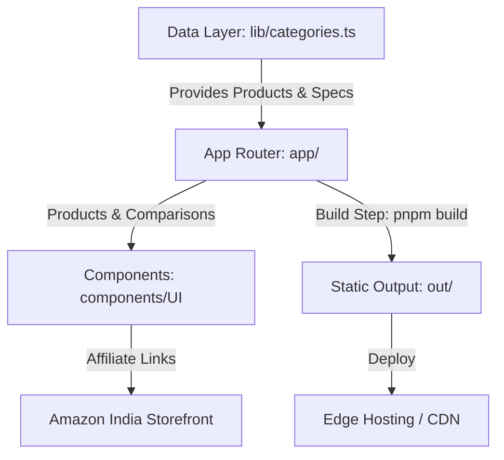

<h1 align="center">TechSelect</h1>

<p align="center">
  
</p>

<p align="center">
  <a href="https://nextjs.org"></a>
  <a href="https://react.dev"></a>
  <a href="https://tailwindcss.com"></a>
  <a href="https://www.typescriptlang.org"></a>
  <a href="https://pnpm.io"></a>
</p>

<p align="center">
  <a href="https://github.com/abs6187"></a>
  <a href="https://github.com/Lost-Alien"></a>
  
  
</p>


---

## Overview

**TechSelect** is a high-performance, opinionated technology review and buying guide web application engineered for speed, SEO, and conversion optimization. Built on Next.js 16 App Router and statically exported for sub-second page loads, TechSelect provides Indian tech buyers with transparent, data-driven product scores, detailed spec breakdowns, and direct affiliate purchase pathways.

> [!NOTE]  
> TechSelect compiles into pure static HTML (`out/` directory), ensuring zero cold-start latency, maximum edge CDN caching, and optimal Google Lighthouse scores (100% Performance & SEO).

---

## Key Features

| Feature | Description |
| :--- | :--- |
| **Next.js 16 SSG** | Static Site Generation architecture for ultra-fast static HTML delivery via edge CDNs. |
| **Tailwind CSS v4** | Cutting-edge utility-first styling with native CSS variable color tokens and dynamic dark mode. |
| **Comparison Matrices** | Side-by-side spec comparisons for laptops, headphones, mobile devices, and smart home tech. |
| **Smart Affiliate Engine** | Deep-linked Amazon India affiliate tracking (`tag=techstor0caaf-21`) with clean outbound UI widgets. |
| **Architecture Guardrails**| Automated linting, circular dependency checks (`dependency-cruiser`), and dead code pruning (`knip`). |
| **Mobile-First Responsive** | Fluid UI built with `@base-ui/react`, standard Radix/Shadcn components, and `lucide-react` icons. |

---

## Architecture & Data Flow



---

## Tech Stack & Tooling

```
 ┌─────────────────────────────────────────────────────────┐
 │                      TECHSELECT STACK                   │
 ├───────────────────┬─────────────────────────────────────┤
 │ Framework         │ Next.js 16.2.6 (App Router)         │
 │ Core Library      │ React 19.0                          │
 │ Styling           │ Tailwind CSS 4.2 + tw-animate-css   │
 │ Language          │ TypeScript 5.7.3                    │
 │ UI Components     │ Base UI, Shadcn, Lucide React       │
 │ Arch Guardrails   │ Dependency Cruiser, Knip, ESLint 10 │
 │ Git Automation    │ Husky v9 + Lint-Staged v17          │
 └───────────────────┴─────────────────────────────────────┘
```

---

## Quick Start & Development Guide

### Prerequisites
- **Node.js**: `v18.0.0` or higher
- **pnpm**: `v9.x` or `v10.x` (`npm i -g pnpm`)

### 1. Clone & Install Dependencies
```bash
git clone https://github.com/Lost-Alien/affiliate-website-updates.git
cd affiliate-website-updates
pnpm install
```

### 2. Launch Development Server
```bash
pnpm dev
```
Navigate to [http://localhost:3000](http://localhost:3000) in your browser.

### 3. Production Static Build
```bash
pnpm build
```
Generates production-ready static assets in the [`out/`](file:///c:/Users/conne/Downloads/affiliate-website-updates/out) folder.

### 4. Code Quality & Verification Scripts
```bash
# Type-check TypeScript codebase
pnpm typecheck

# Lint all files with ESLint v10
pnpm lint

# Audit architectural constraints and dependencies
pnpm lint:arch

# Scan for unused code, exports, and dependencies
pnpm knip
```

---

## Repository Map

```
.
├── app/                       # Next.js App Router (Pages, Layouts, Metadata)
│   ├── article/               # Deep-dive editorial buying guides
│   ├── categories/            # Category pages (Audio, Laptops, Smart Home)
│   ├── products/              # Product detail pages with ratings & specs
│   ├── globals.css            # Global CSS tokens & dynamic dark mode vars
│   └── page.tsx               # Homepage with featured products & hero
├── components/                # Reusable UI React Components
│   ├── article/               # Article headers, callouts, and recommendations
│   ├── product/               # Spec sheets, scorecards, and affiliate buttons
│   ├── header.tsx             # Main site header with navigation
│   └── footer.tsx             # Site footer with affiliate disclosure
├── lib/                       # Core Data Engine & Schema definitions
│   └── categories.ts          # Central source of truth for products & categories
├── public/                    # Static assets, product images, and icons
├── .github/                   # GitHub Actions CI/CD workflows
└── .husky/                    # Pre-commit hooks for automated guardrails
```

---

## Maintainers & Key Contributors

We extend our sincere gratitude to everyone who builds, maintains, and improves TechSelect!

<br/>

<div align="center">
  <table>
    <tr>
      <td align="center" width="200">
        <a href="https://github.com/abs6187">
          <br />
          <sub><b>abs6187</b></sub>
        </a><br />
        <a href="https://github.com/abs6187">
          
        </a><br />
        <a href="https://github.com/abs6187">
          
        </a>
      </td>
      <td align="center" width="200">
        <a href="https://github.com/Lost-Alien">
          <br />
          <sub><b>Lost-Alien</b></sub>
        </a><br />
        <a href="https://github.com/Lost-Alien">
          
        </a><br />
        <a href="https://github.com/Lost-Alien">
          
        </a>
      </td>
    </tr>
  </table>
</div>

### Contributor Roles
- **[@abs6187](https://github.com/abs6187)**: Lead Maintainer & Core Developer — Codebase architecture, Next.js 16 updates, UI component design, and repository guardrails.
- **[@Lost-Alien](https://github.com/Lost-Alien)**: Project Creator & Core Contributor — Initial repository foundation, content structure, and product data definitions.

---

## License & Affiliate Disclosure

- **License**: Distributed under the MIT License. See `LICENSE` for more information.
- **Affiliate Disclosure**: TechSelect is a participant in the Amazon Associates Program. Purchases made through affiliate links on this site generate a referral commission at no additional cost to the user.

---


<p align="center">
  <sub>Maintained by <a href="https://github.com/abs6187">@abs6187</a> and <a href="https://github.com/Lost-Alien">@Lost-Alien</a>.</sub>
</p>
